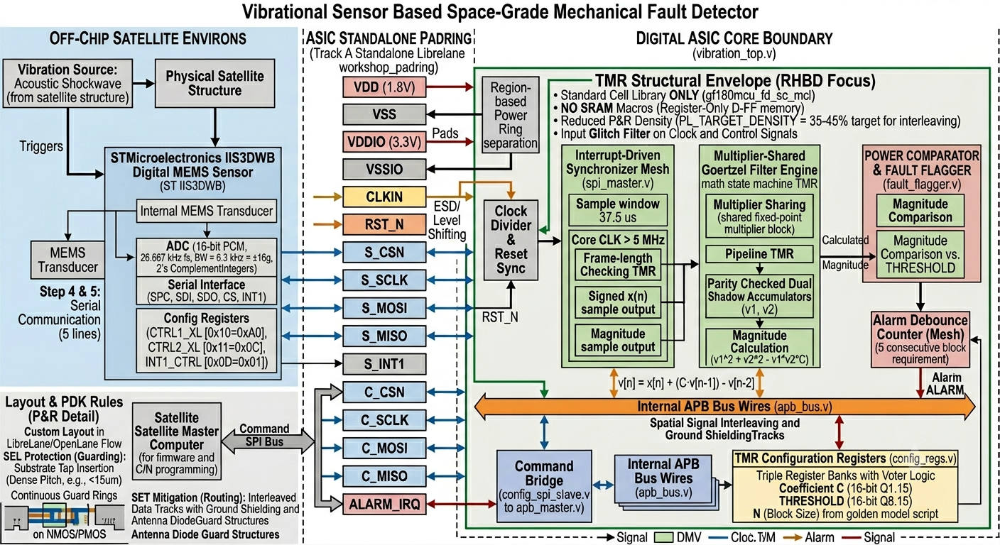

# Space-Grade Mechanical Fault Detector

## SSCS Chipathon 2026 — Track B

Radiation-tolerant ASIC for autonomous spacecraft vibration and mechanical fault detection using the Goertzel algorithm.

Proposal: https://docs.google.com/presentation/d/1MkvMiaDgUpeBVoI5wBfiN7sYO5_Q386jxhhWM7O5BgE/edit?usp=sharing

---

## Overview

Modern spacecraft and satellite systems exhibit characteristic vibration signatures prior to mechanical failure. Detecting these signatures early is critical for mission reliability and autonomous fault recovery.

This project proposes a low-power radiation-tolerant ASIC capable of real-time spectral vibration analysis using a fixed-point Goertzel DSP architecture implemented on GlobalFoundries GF180MCU technology.

The ASIC interfaces with an external space-grade ADC through SPI, performs autonomous frequency-domain analysis, and raises a hardware interrupt upon persistent abnormal vibration detection.

---

## System Architecture



---

## Key Features
* Direct Digital MEMS Interfacing: High-efficiency hardware spi_master.v core engineered specifically to parse the STMicroelectronics IIS3DWB sensor data stream (16-bit 2's complement PCM, 26.667 kHz Output Data Rate, 6.3 kHz mechanical bandwidth).
* Mixed-Precision Fixed-Point Datapath: * Input Vector (x[n]): Native 16-bit signed integer passed directly from the SPI shift registers with zero format-conversion latency.
* Frequency Coefficient (C): 16-bit fixed-point format configured in Q2.14 precision (1 sign bit, 1 integer bit, 14 fractional bits) mapping dynamic target bounds between −2.0 and +2.0 (C=2⋅cos(2πf_k/f_s) 
* State Accumulators (v_1,v_2): Dual historical state channels expanded to 32-bit signed integers to safely absorb severe bit-growth overflow across long block iteration boundaries (N=256 to 512).
* Dynamic Mid-Flight Calibration: Host processing node loads coefficient boundaries dynamically via an SPI-to-APB hardware translation bridge, modifying baseline fault profiles across changing orbit conditions.
* Autonomous Alarm Verification Mesh: Multi-stage TMR'd verification counter ensures that the structural anomaly limit must be breached for 5 consecutive calculation blocks before raising the primary hardware alarm, neutralizing Single Event Transient (SET) false flags.
* SRAM-Free Design Matrix: Fully registers-only implementation. All temporary state retention maps directly to standard logic cell flip-flops, rendering the system impervious to macro-level memory corruption.

---

## Proposed RTL Modules

Module Name,Source File,Description
spi_master.v,rtl/spi_master.v,"Synchronous serial master core tracking ST IIS3DWB bootup protocols, interrupt synchronization, and 16-bit sample capture."
apb_bridge.v,rtl/apb_bridge.v,"Configuration interface translating external Command SPI packets to localized, structured APBv2 bus operations."
config_regs.v,rtl/config_regs.v,"Structural TMR storage framework housing dynamic runtime variables (C [16-bit Q2.14], THRESHOLD [32-bit Integer], N [16-bit Integer])."
goertzel_core.v,rtl/goertzel_core.v,Area-optimized fixed-point math execution core featuring resource-shared multipliers and parity-checked 32-bit storage arrays.
fault_flagger.v,rtl/fault_flagger.v,"Squaring block computing magnitude limits, executing comparison boundaries, and running the TMR debounce validation state machine."
tmr_voter.v,rtl/tmr_voter.v,Primitively synthesized combinational 2-out-of-3 majority voting element deployed across triplicated state fields.
vibration_top.v,rtl/vibration_top.v,"High-level chip enclosure bounding the 1.8V core logic, connecting internal nodes to level-shifted physical pad ring frames."

---

## Proposed Signal Flow

1. External vibration sensor generates analog signal
2. External ADC digitizes signal
3. SPI interface transfers sampled data into ASIC
4. Goertzel core computes target frequency response
5. Power calculator evaluates spectral magnitude
6. Fault logic compares against programmable threshold
7. Hardware interrupt asserted upon persistent fault detection

---

## Radiation Hardening Strategy

To improve reliability in radiation-prone space environments:

* Critical FSMs are triplicated
* Debounce counters use Triple Modular Redundancy (TMR)
* Majority-voter logic mitigates Single Event Upsets (SEUs)

---

## Target Technology

* GlobalFoundries GF180MCU
* OpenLane RTL-to-GDSII Flow
* Verilog HDL

---

## Repository Structure

```text
docs/           → Architecture diagrams and proposal documents
rtl/            → RTL source files
tb/             → Testbenches
verification/   → Verification environment
sim/            → Simulation outputs
scripts/        → Build and automation scripts
openlane/       → ASIC synthesis and physical design flow
```

---

## Team

Team Space Jam

---

## Project Status

Architecture and system planning phase.
