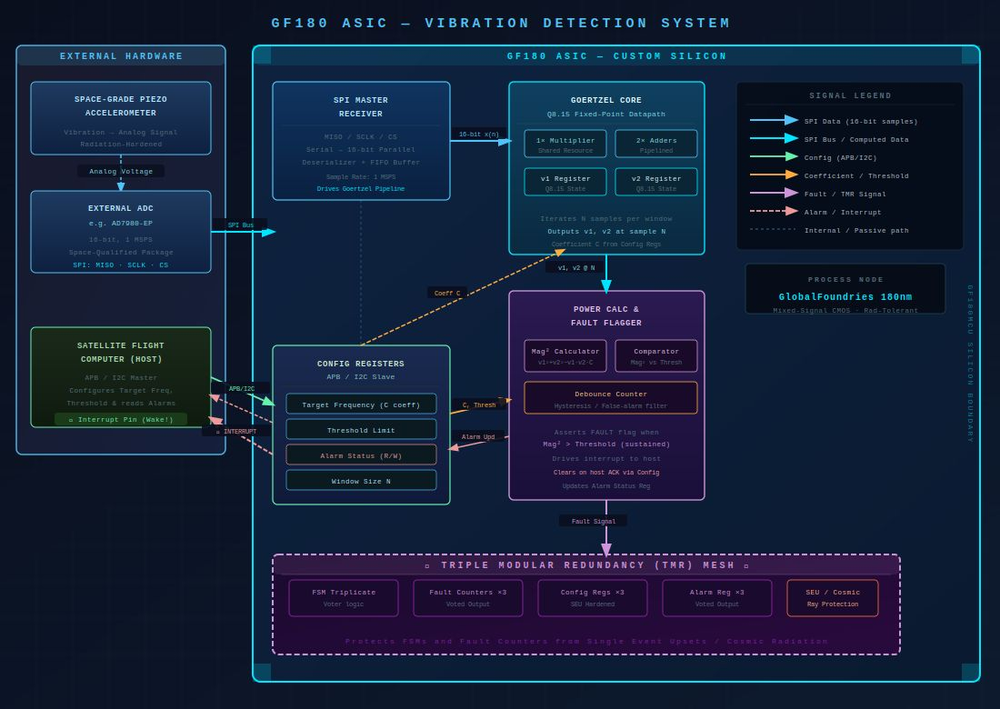

# Space-Grade Mechanical Fault Detector

## SSCS Chipathon 2026 — Track B

Radiation-tolerant ASIC for autonomous spacecraft vibration and mechanical fault detection using the Goertzel algorithm.

---

## Overview

Modern spacecraft and satellite systems exhibit characteristic vibration signatures prior to mechanical failure. Detecting these signatures early is critical for mission reliability and autonomous fault recovery.

This project proposes a low-power radiation-tolerant ASIC capable of real-time spectral vibration analysis using a fixed-point Goertzel DSP architecture implemented on GlobalFoundries GF180MCU technology.

The ASIC interfaces with an external space-grade ADC through SPI, performs autonomous frequency-domain analysis, and raises a hardware interrupt upon persistent abnormal vibration detection.

---

## System Architecture



---

## Key Features

* Fixed-point Goertzel DSP Core (Q8.15)
* SPI Interface for External ADC
* Configurable Threshold & Frequency Registers
* Autonomous Fault Detection
* Debounce-based Alarm Filtering
* Radiation-Tolerant FSM Design
* Triple Modular Redundancy (TMR)
* Low-Power Edge Processing Architecture

---

## Proposed RTL Modules

| Module            | Description                                  |
| ----------------- | -------------------------------------------- |
| `spi_master.v`    | SPI interface for ADC sample acquisition     |
| `config_regs.v`   | Runtime programmable configuration registers |
| `goertzel_core.v` | Fixed-point spectral analysis engine         |
| `fault_flagger.v` | Power calculation and fault decision logic   |
| `tmr_voter.v`     | Majority voter logic for radiation hardening |
| `top.v`           | Top-level ASIC integration                   |

---

## Proposed Signal Flow

1. External vibration sensor generates analog signal
2. External ADC digitizes signal
3. SPI interface transfers sampled data into ASIC
4. Goertzel core computes target frequency response
5. Power calculator evaluates spectral magnitude
6. Fault logic compares against programmable threshold
7. Hardware interrupt asserted upon persistent fault detection

---

## Radiation Hardening Strategy

To improve reliability in radiation-prone space environments:

* Critical FSMs are triplicated
* Debounce counters use Triple Modular Redundancy (TMR)
* Majority-voter logic mitigates Single Event Upsets (SEUs)

---

## Target Technology

* GlobalFoundries GF180MCU
* OpenLane RTL-to-GDSII Flow
* Verilog HDL

---

## Repository Structure

```text
docs/           → Architecture diagrams and proposal documents
rtl/            → RTL source files
tb/             → Testbenches
verification/   → Verification environment
sim/            → Simulation outputs
scripts/        → Build and automation scripts
openlane/       → ASIC synthesis and physical design flow
```

---

## Team

Team Space Jam

---

## Project Status

Architecture and system planning phase.
