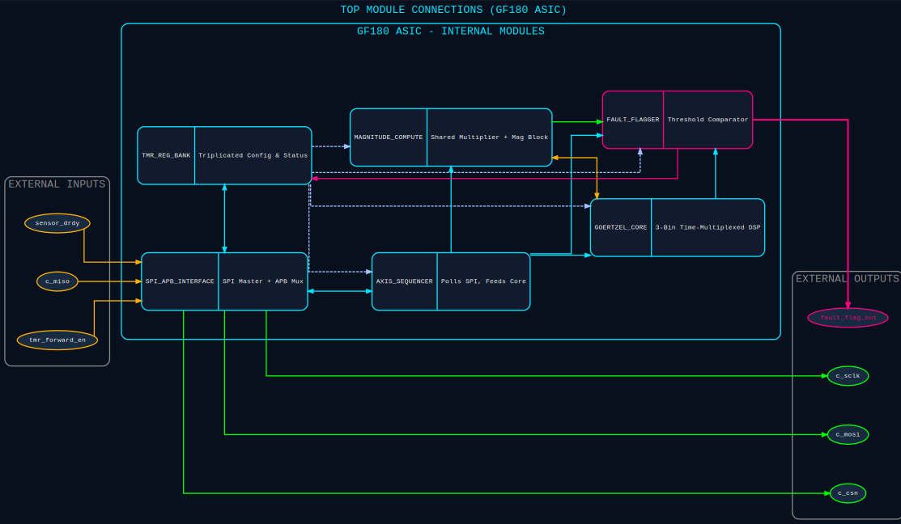

# Space-Grade Mechanical Fault Detector

> **SSCS Chipathon 2026 — Track B (Sensor Circuits)**
> Radiation-hardened-by-design (RHBD) ASIC for autonomous spacecraft vibration and mechanical fault detection, built around a 3-bin time-multiplexed Goertzel DSP core targeting the GlobalFoundries GF180MCU node via the open-source LibreLane RTL-to-GDS flow.

---

## Table of Contents

- [Overview](#overview)
- [System Architecture](#system-architecture)
- [Signal Chain Walkthrough](#signal-chain-walkthrough)
- [Module Reference](#module-reference)
- [Fixed-Point Datapath](#fixed-point-datapath)
- [Radiation Hardening Strategy (RHBD)](#radiation-hardening-strategy-rhbd)
- [Area/Latency Design Tradeoff](#arealatency-design-tradeoff)
- [Verification Status](#verification-status)
- [Target Technology Configuration](#target-technology-configuration)
- [Repository Structure](#repository-structure)
- [Building and Running the Testbenches](#building-and-running-the-testbenches)
- [Team](#team)
- [Project Status](#project-status)

---

## Overview

Modern spacecraft and satellite systems exhibit distinct high-frequency mechanical vibration signatures prior to catastrophic mechanical failure — reaction wheel bearing degradation, cryogenic pump wear, deployment gear micro-cracks. Detecting these signatures early, at the structural edge, is critical for autonomous fault isolation and telemetry reduction.

This project implements a compact, radiation-tolerant edge-processing ASIC that performs real-time spectral vibration analysis using a custom **3-bin, time-multiplexed Goertzel DSP core**, targeting the GlobalFoundries 180 nm (GF180MCU) node.

The ASIC interfaces directly with an off-chip **STMicroelectronics IIS3DWB** digital MEMS vibration sensor over SPI, computes per-axis frequency-domain energy at three programmable fault frequencies, and asserts a sticky hardware fault flag when any bin/axis combination exceeds a configurable threshold. The design is entirely flip-flop based — no SRAM macros — to keep it robust against heavy-ion-induced single event upsets (SEUs) on a commercial bulk CMOS process with no inherent radiation tolerance.

---

## System Architecture

```
                 ┌──────────────────────────────────────────────────────────────────┐
                 │                          rtl/top.v                               │
                 │                                                                  │
 IIS3DWB  ─SPI──▶│  spi_apb_interface           axis_sequencer                      │
 (sensor)        │  ├─ spi_master (FSM: boot     ├─ polls spi_apb_interface's       │
 sensor_drdy ───▶│  │  config-write + burst read) │  local STATUS/SAMPLE0/1 regs    │
                 │  └─ apb (master, Option B      ├─ demuxes the 48-bit XYZ burst   │
                 │     sample forwarding only)    │  into per-axis 16-bit samples   │
                 │                                 └─ rotates X→Y→Z every block     │
                 │                                        │                         │
                 │                                        ▼                         │
                 │                                 goertzel_core                    │
                 │                                 (3-bin shared-multiplier IIR)    │
                 │                                        │  v1/v2 state (x6)       │
                 │                                        ▼                         │
                 │                                 magnitude_compute                │
                 │                                 (services shared multiplier,     │
                 │                                  computes |X(f_k)|^2 per bin)    │
                 │                                        │  mag_out + bin/axis tag │
                 │                                        ▼                         │
                 │                                 fault_flagger                    │
                 │                                 (171-sample block counter,       │
                 │                                  threshold compare, sticky flag) │
                 │                                        │                         │
                 │              ┌─────────────────────────┘                         │
                 │              ▼                                                   │
                 │        tmr_reg_bank ◀── internal APB bus ── spi_apb_interface    │
                 │        (triplicated, scrubbed config/status registers)           │
                 └──────────────────────────────────────────────────────────────────┘
                                                        │
                                                        ▼
                                              fault_flag_out (to host/RISC core)
```

`top.v` is the chip-level integration module. Its **only external pins** are the sensor SPI bus (`c_miso`/`c_csn`/`c_sclk`/`c_mosi`), the sensor's `sensor_drdy` interrupt, a `tmr_forward_en` mode-select input, and the single `fault_flag_out` alarm line — there is no separate command-SPI or host-programming bus inside the current core boundary. Runtime coefficients (`cfg_c0/c1/c2`, `cfg_threshold`) and control (`cfg_start/cfg_stop/cfg_fault_clear`) live in `tmr_reg_bank`, driven over the *internal* APB bus. In the current architecture that internal bus is exercised from testbenches via direct APB transactions; a host-facing SPI-to-APB (or other bus) bridge sitting outside `top.v`'s boundary is the natural next integration step and is called out explicitly below as future work rather than claimed as already implemented.



---

## Signal Chain Walkthrough

1. **`spi_master`** (inside `spi_apb_interface`) runs the IIS3DWB bring-up sequence on reset — writing `CTRL1_XL` (26.667 kHz ODR), `FIFO_CTRL4` (bypass, no on-sensor FIFO), `CTRL3_C` (auto-increment burst reads), and `INT1_CTRL` (route `DRDY` to `INT1`) — then waits for `sensor_drdy`, asserts chip-select, and shifts in a 48-bit burst covering all three axes (`OUTX`, `OUTY`, `OUTZ`) in SPI Mode 3.
2. **`spi_apb_interface`** latches the 48-bit sample into local registers exposed at three byte addresses (`STATUS`, `SAMPLE0`, `SAMPLE1`), readable through a simple request/done handshake. An optional second mode (`tmr_forward_en=1`) additionally forwards each raw sample into `tmr_reg_bank` over the internal APB bus for host visibility; the default mode (`tmr_forward_en=0`) keeps the sample local only.
3. **`axis_sequencer`** polls those local registers, reconstructs the 48-bit burst, and slices out the correct 16-bit Q1.15 sample for whichever axis is currently active (X, Y, or Z), rotating to the next axis every time a processing block closes.
4. **`goertzel_core`** runs the classic second-order IIR recursion `v[n] = x[n] + C·v[n-1] − v[n-2]` for three independent frequency bins in Q8.15 fixed-point, all three sharing a single hardware multiplier via time multiplexing (6 active clock cycles per incoming sample; the multiplier is otherwise held frozen for zero switching power).
5. **`magnitude_compute`** snapshots each bin's `v1`/`v2` state and coefficient at the block boundary, reuses the *same* shared multiplier during otherwise-idle cycles to compute `|X(f_k)|² = v1² + v2² − C·v1·v2` for all three bins, and tags each result with both its frequency bin index and the physical axis (X/Y/Z) that produced it.
6. **`fault_flagger`** owns the 171-sample block counter, compares every tagged magnitude against `cfg_threshold`, and latches a sticky `fault_flag` (plus the offending bin and axis) on the first magnitude that exceeds threshold. The flag stays asserted until explicitly cleared via `cfg_fault_clear`.
7. **`tmr_reg_bank`** is the single APB slave in the design: it holds the triplicated, periodically-scrubbed coefficient/threshold/control registers and exposes fault status for read-back.

---

## Module Reference

| Module | Source File | Description |
|---|---|---|
| `top` | `rtl/top.v` | Chip-level integration: wires the sensor SPI front end, axis sequencer, Goertzel core, magnitude engine, fault flagger, and register bank together; the only hierarchy level with external pins |
| `spi_apb_interface` | `rtl/spi_apb_interface.v` | Owns `spi_master`; exposes a local poll-based register interface for the current sensor sample, plus an optional forwarding path that mirrors each sample into `tmr_reg_bank` over the internal APB bus |
| `spi_master` | `rtl/spi_master.v` | SPI Mode 3 master implementing the IIS3DWB power-on boot config sequence and the 48-bit XYZ burst-read protocol, synchronized to the async `sensor_drdy` interrupt |
| `apb` | `rtl/apb.v` | Minimal request-driven APB master: converts a simple `req_valid`/`req_write`/`req_addr`/`req_wdata` handshake into a compliant SETUP/ACCESS APB transfer |
| `axis_sequencer` | `rtl/axis_sequencer.v` | Polls `spi_apb_interface` for each new burst, demultiplexes the X/Y/Z slice for the currently active axis, and advances the axis round-robin on every block boundary; axis index and polling FSM are TMR-protected and periodically scrubbed |
| `goertzel_core` | `rtl/goertzel_core.v` | 3-bin time-multiplexed Goertzel IIR engine in Q8.15 fixed-point, sharing one multiplier across all three bins; control FSM is triplicated with a self-scrubbing majority voter |
| `magnitude_compute` | `rtl/magnitude_compute.v` | Snapshots Goertzel state at each block boundary and computes the per-bin, per-axis magnitude by reusing the same shared multiplier during its idle cycles; FSM is triplicated |
| `fault_flagger` | `rtl/fault_flagger.v` | Owns the (currently 171-sample) block counter, compares magnitudes against a programmable threshold, and latches a sticky fault flag with bin/axis attribution |
| `tmr_reg_bank` | `rtl/tmr_reg_bank.v` | APB slave holding the triplicated, scrubbed configuration registers (`CTRL`, `CFG_C0/C1/C2`, `CFG_THRESHOLD`) and read-only status (`STATUS`, `FAULT_MAG`, `FAULT_BIN`) |
| `ff_2_sync` | `rtl/ff_2_sync.v` | Generic two-stage D-flip-flop synchronizer used to bring the async `sensor_drdy` and `s_miso` lines into the core clock domain |
| `clk_divider_5` | `rtl/clk_divider_5.v` | Divide-by-5 clock divider generating the SPI bit clock from the system clock |

---

## Fixed-Point Datapath

| Signal | Width | Format |
|---|---|---|
| Sensor sample `x_n` | 16-bit | Q1.15 signed fixed-point (as delivered by `axis_sequencer`) |
| Goertzel coefficients `C0/C1/C2` | 24-bit | Q8.15 signed fixed-point, one per frequency bin, stored in `tmr_reg_bank` |
| State registers `v1_k`, `v2_k` (k = 0..2) | 24-bit | Q8.15 signed fixed-point, saturating add/sub |
| Shared multiplier product | 48-bit internal → 24-bit | Full product right-shifted by 15 (`>>> 15`), then saturated back to Q8.15 |
| Magnitude `|X(f_k)|²` | 32-bit | Unsigned integer, clamped to zero on underflow |
| Threshold `cfg_threshold` | 32-bit | Unsigned integer, host/testbench configurable |
| Block size | 171 samples | Fixed parameter in `fault_flagger` (`BLOCK_SIZE`) |

**Recursion:** `v[n] = x[n] + C·v[n-1] - v[n-2]`, computed as a single fused three-input saturating add per active bin (no separate accumulator register — the multiplier product and the `x - v2` term are summed directly), so each bin costs exactly two active clock cycles per sample (one multiplier request, one fused update) rather than three.

**Terminal magnitude:** `|X(f_k)|² = v1_k² + v2_k² - C_k·v1_k·v2_k`, computed by `magnitude_compute` using three extra multiplier operations per bin, scheduled into cycles the Goertzel core's own multiplier requests leave idle.

---

## Radiation Hardening Strategy (RHBD)

GlobalFoundries 180 nm bulk CMOS has no inherent radiation tolerance, so hardening is applied at the RTL and microarchitecture level:

**Triple Modular Redundancy (TMR) with self-scrubbing.** Every control FSM (`goertzel_core`, `magnitude_compute`, `axis_sequencer`) and every configuration register bank (`tmr_reg_bank`) keeps three physical copies of its state, continuously combined by a bitwise 2-of-3 majority voter (`vote2`/`vote3`/`vote32` functions). Critically, all three copies are re-written from the *voted* value every cycle rather than only from each other — so a single-bit upset in one copy is corrected on the very next clock edge instead of being allowed to persist or diverge.

**Periodic background scrubbing.** `axis_sequencer`'s axis index and `tmr_reg_bank`'s configuration fields are additionally rewritten from their voted value on a fixed period (every 1024 cycles) even with no incoming write, bounding the maximum time a latent bit-flip can survive between accesses.

**SEU-safe default states.** Every triplicated FSM's next-state logic defaults to a safe idle/reset state (`S_IDLE`) for any unreachable/illegal state encoding, so an upset that produces an invalid code recovers automatically within one clock rather than hanging.

**SRAM-free register matrix.** The entire design is flip-flop only — no SRAM macros anywhere in the datapath or configuration storage — avoiding the higher single-event and multi-bit-upset sensitivity of dense memory macros on this process.

**Sticky fault latch with explicit clear.** `fault_flagger`'s fault output is a level-sensitive latch that only clears on an explicit `cfg_fault_clear` write, so a transient magnitude spike is not silently lost even if it occurs between host polls.

> Physical-level RHBD techniques (substrate tapping pitch, guard rings, spatially interleaved bus routing, relaxed placement density for antenna-diode insertion) are planned for the LibreLane physical implementation stage but are not yet reflected in a checked-in `librelane` configuration file — see [Project Status](#project-status).

---

## Area/Latency Design Tradeoff

**Constraint:** the IIS3DWB delivers X, Y, and Z samples simultaneously every 37.5 µs, but the competition's 600×600 µm die budget does not allow three parallel Goertzel pipelines.

| Option | Approach | Area Impact | Per-axis Detection Latency | Selected |
|--------|----------|--------------|------------------------------|----------|
| 1 | Three parallel Goertzel cores (one per axis) | Exceeds die budget | 6.4 ms (all axes in parallel) | ❌ |
| 2 | Buffer all three axes, process sequentially from a sample buffer | +thousands of flip-flops, violates the SRAM-free RHBD strategy | 19.2 ms | ❌ |
| **3** | **Single shared-multiplier core, sequential axis rotation, reduced block size** | **0 additional flip-flops** | **6.4 ms per axis / 19.2 ms full 3-axis cycle** | ✅ |

The selected design (`axis_sequencer` rotating X→Y→Z, `fault_flagger`'s `BLOCK_SIZE = 171`) accepts two explicit, documented limitations in exchange for meeting the area budget with zero added state:

- **Sequential axis processing.** Only one axis is actively accumulating Goertzel state at any given time; samples from the other two axes are not analyzed during that window. Simultaneous faults on multiple axes within the same ~19.2 ms cycle are not guaranteed to be caught in the same window they occur.
- **Coarser frequency resolution.** Reducing the block from 512 to 171 samples widens each frequency bin from ~52 Hz to ~157 Hz. This is acceptable because the target fault signatures (bearing wear, pump imbalance, gear micro-fracture tones) are narrowband and well separated in the 1–12 kHz mechanical bandwidth of interest.

This tradeoff is appropriate for the competition's area-constrained edge-processing use case, where mechanical degradation develops over hours-to-days and a 19.2 ms full-cycle latency is far faster than needed. A mission design with a larger area budget would revisit Option 1 to guarantee simultaneous multi-axis coverage.

---

## Verification Status

Three testbench suites plus one full-chip integration testbench currently pass in simulation (Icarus Verilog):

| Testbench | Target | Result |
|---|---|---|
| `testing/spi_master_test/tb_spi_master_full.v` | `spi_master` — boot sequence, DRDY sync, SPI Mode 3 protocol, 48-bit burst read | 71/71 checks passing |
| `testing/apb_test/tb_spi_apb_interface.v` | `spi_apb_interface` + `apb` — Option A/B sample delivery and forwarding | Passing |
| `testing/goertzel_core/tb_goertzel_core.v` | `goertzel_core` — 3-bin recursion accuracy, Q8.15 arithmetic, `sample_done` timing (500-sample run) | Passing |
| `testing/top_test/tb_top.v` | `top` — full sensor-to-`fault_flag_out` chain, using the `iis3dwb_model.v` bus-functional sensor model | 7/7 checks passing (normal operation + per-axis fault injection on X, Y, and Z with correct axis attribution) |

The top-level testbench is the only test that exercises axis attribution end-to-end; it caught and helped fix a real silent bug in the shared-multiplier capture timing in `magnitude_compute.v` (previously `mag_out` was always zero — see `CHANGELOG.md` for the full root-cause writeup) before this pass. Known verification gaps, tracked as future work rather than hidden: no testbench currently injects **simultaneous** multi-axis faults (a realistic spacecraft scenario the sequential architecture cannot resolve within a single rotation), and gate-level/post-synthesis simulation has not yet been run.

---

## Target Technology Configuration

| Parameter | Value |
|---|---|
| Foundry Node | GlobalFoundries GF180MCU |
| RTL-to-GDS Flow | LibreLane open-source digital flow |
| Standard Cell Library | `gf180mcu_fd_sc_mcl` |
| Source Language | Verilog HDL (IEEE 1364) |
| Core Supply Voltage | 1.8 V |
| Target Core Clock | 5–10 MHz |
| Sensor ODR | 26.667 kHz (IIS3DWB, fixed by boot configuration) |
| Block Size | 171 samples/axis |
| Per-axis Detection Latency | ~6.4 ms |
| Full 3-axis Cycle | ~19.2 ms |

---

## Repository Structure

```
.
├── docs/                # Architecture notes, verification reports, presentation deck
├── rtl/                 # Synthesizable Verilog HDL source (see Module Reference)
│   ├── apb.v
│   ├── axis_sequencer.v
│   ├── clk_divider_5.v
│   ├── fault_flagger.v
│   ├── ff_2_sync.v
│   ├── goertzel_core.v
│   ├── magnitude_compute.v
│   ├── spi_apb_interface.v
│   ├── spi_master.v
│   ├── tmr_reg_bank.v
│   └── top.v
├── testing/             # Per-module Icarus Verilog testbenches + generated waveforms
│   ├── spi_master_test/
│   ├── apb_test/
│   ├── goertzel_core/
│   └── top_test/
├── tb/                  # (reserved for additional bus-functional models)
├── sim/                 # (reserved for simulation configs)
├── verification/        # (reserved for golden fixed-point reference models)
├── librelane/runs/      # Prior LibreLane synthesis/PnR run logs and reports
├── openlane/            # (reserved for physical design configuration)
├── Makefile             # sim_spi / sim_apb / sim_goertzel / sim_top / sim_all / clean
└── CHANGELOG.md          # Detailed bug-fix and verification history
```

---

## Building and Running the Testbenches

All testbenches use [Icarus Verilog](http://iverilog.icarus.com/) (`iverilog`/`vvp`). From the repository root:

```bash
make sim_spi        # spi_master standalone (IIS3DWB boot + burst read)
make sim_apb        # spi_apb_interface + apb (Option A/B sample delivery)
make sim_goertzel   # goertzel_core standalone (3-bin recursion + Q8.15 accuracy)
make sim_top        # full chain: sensor SPI in -> fault_flag_out + axis attribution
make sim_all        # run all four suites
make clean          # remove generated sim binaries and VCD dumps
```

Each target produces a VCD waveform dump in its corresponding `testing/<block>/` directory, viewable with GTKWave or any other VCD viewer.

---

## Team

**B22 — Team Space Jam**
SSCS Chipathon 2026, Track B (Sensor Circuits)

---

## Project Status

- [x] System architecture implemented in RTL (`top.v` integration complete)
- [x] IIS3DWB SPI boot sequence and burst-read protocol implemented and verified
- [x] 3-bin time-multiplexed Goertzel core with shared multiplier implemented and verified
- [x] Axis sequencing, magnitude computation, and fault flagging implemented and verified
- [x] TMR + scrubbing applied to control FSMs and configuration registers
- [x] Full-chain functional simulation passing (per-module + top-level integration)
- [ ] Simultaneous multi-axis fault injection testing
- [ ] Gate-level / post-synthesis simulation
- [ ] LibreLane synthesis and timing closure for the current RTL (`librelane/runs/` contains logs from earlier architecture iterations only)
- [ ] Physical layout, DRC/LVS sign-off, and physical-level RHBD (guard rings, substrate tapping, routing density constraints)
- [ ] Host-facing command/configuration bus bridge outside the `top.v` boundary
- [ ] Final GDS submission

---

*Built with LibreLane · GF180MCU · gf180mcu_fd_sc_mcl*
