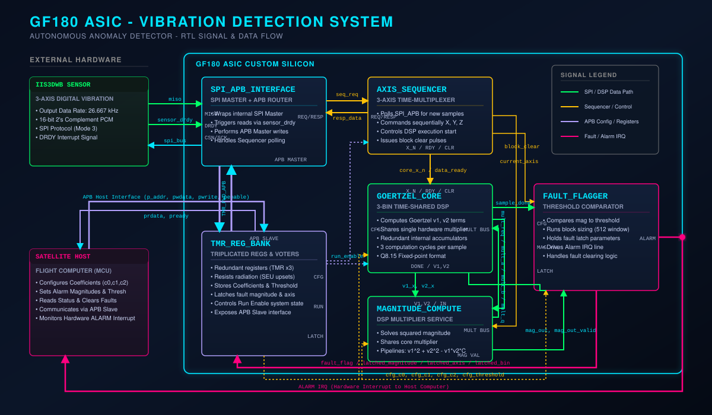

# Space-Grade Mechanical Fault Detector

> **SSCS Chipathon 2026 — Track B (Sensor Circuits)**
> Radiation-hardened-by-design (RHBD) ASIC for autonomous spacecraft vibration and mechanical fault detection, built around a 3-bin **Interleaved Tri-Axis Goertzel (ITAG)** DSP core targeting the GlobalFoundries GF180MCU node via the open-source LibreLane RTL-to-GDS flow.

---

## Table of Contents

- [Reviewer Documentation](#reviewer-documentation)
- [Overview](#overview)
- [System Architecture](#system-architecture)
- [Signal Chain Walkthrough](#signal-chain-walkthrough)
- [Module Reference](#module-reference)
- [Fixed-Point Datapath](#fixed-point-datapath)
- [Radiation Hardening Strategy (RHBD)](#radiation-hardening-strategy-rhbd)
- [Area/Latency Design Tradeoff](#arealatency-design-tradeoff)
- [Verification Status](#verification-status)
- [Target Technology Configuration](#target-technology-configuration)
- [Repository Structure](#repository-structure)
- [Building and Running the Testbenches](#building-and-running-the-testbenches)
- [Team](#team)
- [Project Status](#project-status)

---

## Reviewer Documentation

The following documents directly address each point of reviewer feedback. Start here for a structured evaluation of the project.

| Reviewer Concern | Document |
|---|---|
| 📋 **Project Tracker** — progress evaluation for the circuit | [`docs/project/PROJECT_TRACKER.md`](docs/project/PROJECT_TRACKER.md) |
| 🏗️ **System Architecture** — detailed block diagram, signal chain, module hierarchy | [`docs/specs/SYSTEM_ARCHITECTURE.md`](docs/specs/SYSTEM_ARCHITECTURE.md) |
| ✅ **Verification Methodology** — what each simulation tests, expected behavior, how results confirm correctness | [`docs/verification/VERIFICATION_METHODOLOGY.md`](docs/verification/VERIFICATION_METHODOLOGY.md) |
| 🧪 **Test Scenarios** — SPI input format, per-case stimulus/output tables, all 100 check assertions | [`docs/verification/TEST_SCENARIOS.md`](docs/verification/TEST_SCENARIOS.md) |
| 🔌 **I/O Specification** — every pin, SPI protocol, output format, register map | [`docs/specs/IO_SPECIFICATION.md`](docs/specs/IO_SPECIFICATION.md) |
| 📡 **SPI Implementation** — team-developed origin, IIS3DWB compliance, references | [`docs/specs/SPI_IMPLEMENTATION.md`](docs/specs/SPI_IMPLEMENTATION.md) |
| ⚙️ **Goertzel Core Explanation** — ITAG architecture, FSM, fixed-point math, radiation hardening, simulation evidence | [`docs/specs/GOERTZEL_CORE_EXPLANATION.md`](docs/specs/GOERTZEL_CORE_EXPLANATION.md) |
| 🔬 **ITAG Architecture Analysis** — pre-implementation timing, area, power, RHBD, tradeoff analysis | [`docs/architecture/ITAG_ARCHITECTURE_ANALYSIS.md`](docs/architecture/ITAG_ARCHITECTURE_ANALYSIS.md) |
| 🏭 **Physical Implementation Results** — actual LibreLane synthesis/PnR/signoff metrics, TMR survival, timing closure | [`docs/architecture/PHYSICAL_IMPLEMENTATION_RESULTS.md`](docs/architecture/PHYSICAL_IMPLEMENTATION_RESULTS.md) |
| 🔍 **Gate-Level Verification Gaps** — what physical verification was and wasn't done, ahead of gate-level cocotb work | [`docs/verification/GATE_LEVEL_VERIFICATION_GAPS.md`](docs/verification/GATE_LEVEL_VERIFICATION_GAPS.md) |
| 🧷 **Chip-Top Padring Integration** — `slot_1x1` pad map, macro placement, template patches, LVS caveat | [`padring/README.md`](padring/README.md) |

**Current verification result: 100/100 self-checking simulation assertions PASS** across all four testbench suites. **Physical implementation (synthesis → place & route → signoff) is complete for the `top` macro**, with clean DRC/LVS/XOR/antenna and timing closed (0 setup/hold violations) across all 9 PVT corners — see the Physical Implementation Results doc above for full metrics.

---

## Overview

Modern spacecraft and satellite systems exhibit distinct high-frequency mechanical vibration signatures prior to catastrophic mechanical failure — reaction wheel bearing degradation, cryogenic pump wear, deployment gear micro-cracks. Detecting these signatures early, at the structural edge, is critical for autonomous fault isolation and telemetry reduction.

This project implements a compact, radiation-tolerant edge-processing ASIC that performs real-time spectral vibration analysis using a custom **3-bin Interleaved Tri-Axis Goertzel (ITAG) DSP core**, targeting the GlobalFoundries 180 nm (GF180MCU) node. A single shared hardware multiplier is time-multiplexed across all three frequency bins of all three axes, plus the magnitude engine — processing X, Y and Z within every sample period rather than rotating one axis per block.

The ASIC interfaces directly with an off-chip **STMicroelectronics IIS3DWB** digital MEMS vibration sensor over SPI, computes per-axis frequency-domain energy at three programmable fault frequencies, and asserts a sticky hardware fault flag when any bin/axis combination exceeds a configurable threshold. The design is entirely flip-flop based — no SRAM macros — to keep it robust against heavy-ion-induced single event upsets (SEUs) on a commercial bulk CMOS process with no inherent radiation tolerance.

---

## System Architecture

```
                 ┌──────────────────────────────────────────────────────────────────┐
                 │                          rtl/top.v                               │
                 │                                                                  │
 IIS3DWB  ─SPI──▶│  spi_apb_interface           axis_sequencer                      │
 (sensor)        │  ├─ spi_master (FSM: boot     ├─ polls spi_apb_interface's       │
 sensor_drdy ───▶│  │  config-write + burst read) │  local STATUS/SAMPLE0/1 regs    │
                 │  └─ apb (master, Option B      ├─ demuxes the 48-bit XYZ burst   │
                 │     sample forwarding only)    │  into per-axis 16-bit samples   │
                 │                                 └─ presents X, Y, Z together    │
                 │                                        │  (no axis rotation)     │
                 │                                        ▼                         │
                 │                                 goertzel_core                    │
                 │                                 (ITAG: 3 bins x 3 axes,          │
                 │                                  shared-multiplier IIR)          │
                 │                                        │  v1/v2 state (x18)      │
                 │                                        ▼                         │
                 │                                 magnitude_compute                │
                 │                                 (owns the single multiplier.v;   │
                 │                                  computes |X(f_k)|^2 for all      │
                 │                                  9 axis/bin pairs per block)     │
                 │                                        │  mag_out + bin/axis tag │
                 │                                        ▼                         │
                 │                                 fault_flagger                    │
                 │                                 (512-sample block counter,       │
                 │                                  threshold compare, sticky flag) │
                 │                                        │                         │
                 │              ┌─────────────────────────┘                         │
                 │              ▼                                                   │
 host/RISC ─cmd──▶│ cmd_spi_slave ─▶ apb ──┐                                        │
 SPI (write-only)│                          ▼                                       │
                 │        tmr_reg_bank ◀── apb_arb2 ◀── spi_apb_interface           │
                 │        (triplicated, scrubbed config/status registers)           │
                 └──────────────────────────────────────────────────────────────────┘
                                                        │
                                                        ▼
                                              fault_flag_out (to host/RISC core)
```

`top.v` is the chip-level integration module. Its external pins are the sensor SPI bus (`c_miso`/`c_csn`/`c_sclk`/`c_mosi`), the sensor's `sensor_drdy` interrupt, a `tmr_forward_en` mode-select input, a **host-facing command-SPI bus** (`cmd_sclk`/`cmd_csn`/`cmd_mosi`, write-only), and the single `fault_flag_out` alarm line. Runtime coefficients (`cfg_c0/c1/c2`, `cfg_threshold`) and control (`cfg_start/cfg_stop/cfg_fault_clear`) live in `tmr_reg_bank`, driven over the *internal* APB bus. That internal bus now has two legal masters, arbitrated by `apb_arb2` (command-SPI has priority): the command-SPI path (`cmd_spi_slave` → `apb`) for real host configuration, and `spi_apb_interface`'s optional Option-B sample-forwarding path. Testbenches may still drive the internal APB bus directly via hierarchical force for convenience, but a real host now has a proper, silicon-legal path onto the chip that does not require that trick.

> 📐 For a fully detailed signal-level block diagram with per-module port descriptions, see [`docs/specs/SYSTEM_ARCHITECTURE.md`](docs/specs/SYSTEM_ARCHITECTURE.md).



---

## Signal Chain Walkthrough

1. **`spi_master`** (inside `spi_apb_interface`) runs the IIS3DWB bring-up sequence on reset — writing `CTRL1_XL` (26.667 kHz ODR), `FIFO_CTRL4` (bypass, no on-sensor FIFO), `CTRL3_C` (auto-increment burst reads), and `INT1_CTRL` (route `DRDY` to `INT1`) — then waits for `sensor_drdy`, asserts chip-select, and shifts in a 48-bit burst covering all three axes (`OUTX`, `OUTY`, `OUTZ`) in SPI Mode 3.
2. **`spi_apb_interface`** latches the 48-bit sample into local registers exposed at three byte addresses (`STATUS`, `SAMPLE0`, `SAMPLE1`), readable through a simple request/done handshake. An optional second mode (`tmr_forward_en=1`) additionally forwards each raw sample into `tmr_reg_bank` over the internal APB bus for host visibility; the default mode (`tmr_forward_en=0`) keeps the sample local only.
3. **`axis_sequencer`** polls those local registers, reconstructs the 48-bit burst, and presents all three 16-bit Q1.15 axis slices (X, Y, Z) to the core *simultaneously* — there is no longer any per-block axis rotation or `current_axis` tracking.
4. **`goertzel_core`** runs the classic second-order IIR recursion `v[n] = x[n] + C·v[n-1] − v[n-2]` for three independent frequency bins on all three axes (9 resonators total) in Q8.15 fixed-point, all sharing a single hardware multiplier via time multiplexing (18 active clock cycles per incoming sample — 6 per axis; the multiplier is otherwise held frozen for zero switching power). This is the **Interleaved Tri-Axis Goertzel (ITAG)** microarchitecture.
5. **`magnitude_compute`** owns the design's single `multiplier.v` instance, snapshots each axis/bin's `v1`/`v2` state and coefficient at the block boundary, and reuses that same shared multiplier during otherwise-idle cycles to compute `|X(f_k)|² = v1² + v2² − C·v1·v2` for all **9 axis/bin pairs**, tagging each result with both its frequency bin index and the physical axis (X/Y/Z) that produced it. The `C·v1·v2` cross term also rides the shared multiplier, so exactly one multiplier exists in the whole datapath.
6. **`fault_flagger`** owns the 512-sample block counter, compares every tagged magnitude against `cfg_threshold`, and latches a sticky `fault_flag` (plus the offending bin and axis) on the first magnitude that exceeds threshold. The flag stays asserted until explicitly cleared via `cfg_fault_clear`.
7. **`tmr_reg_bank`** is the single APB slave in the design: it holds the triplicated, periodically-scrubbed coefficient/threshold/control registers and exposes fault status for read-back. Its APB port is shared between two masters via `apb_arb2` — the host-facing `cmd_spi_slave` path (priority) and `spi_apb_interface`'s optional Option-B sample-forwarding path.

---

## Module Reference

| Module | Source File | Description |
|---|---|---|
| `top` | `rtl/top.v` | Chip-level integration: wires the sensor SPI front end, command-SPI receiver, APB arbiter, axis sequencer, Goertzel core, magnitude engine, fault flagger, and register bank together; the only hierarchy level with external pins |
| `spi_apb_interface` | `rtl/spi_apb_interface.v` | Owns `spi_master`; exposes a local poll-based register interface for the current sensor sample, plus an optional forwarding path that mirrors each sample into `tmr_reg_bank` over the internal APB bus |
| `spi_master` | `rtl/spi_master.v` | SPI Mode 3 master implementing the IIS3DWB power-on boot config sequence and the 48-bit XYZ burst-read protocol, synchronized to the async `sensor_drdy` interrupt |
| `cmd_spi_slave` | `rtl/cmd_spi_slave.v` | **Host-facing command-SPI receiver.** Write-only, SPI Mode 3, single-clock oversampled (no second clock domain — `cmd_sclk`/`cmd_csn`/`cmd_mosi` are 2-FF synchronized and sampled in the `clk` domain, host must clock `cmd_sclk` ≤ `clk`/4). Receives 40-bit `{addr[7:0], data[31:0]}` frames and turns each into an APB write request |
| `apb` | `rtl/apb.v` | Minimal request-driven APB master: converts a simple `req_valid`/`req_write`/`req_addr`/`req_wdata` handshake into a compliant SETUP/ACCESS APB transfer. Instantiated twice — once inside `spi_apb_interface` (Option-B sample forwarding), once directly in `top.v` for the command-SPI path |
| `apb_arb2` | `rtl/apb_arb2.v` | 2-master/1-slave APB arbiter (registered grant) sharing `tmr_reg_bank`'s single APB slave port between the command-SPI config path (priority) and the Option-B sample-forwarding path |
| `axis_sequencer` | `rtl/axis_sequencer.v` | Polls `spi_apb_interface` for each new burst and presents all three X/Y/Z slices to the core simultaneously (no axis rotation under ITAG); polling FSM is TMR-protected |
| `goertzel_core` | `rtl/goertzel_core.v` | Interleaved Tri-Axis (ITAG) 3-bin Goertzel IIR engine in Q8.15 fixed-point: 9 resonators (3 bins × 3 axes) processed every sample via a 19-state FSM sharing one multiplier; control FSM is triplicated (5-bit `vote5`) with a self-scrubbing majority voter |
| `multiplier` | `rtl/multiplier.v` | The single, chip-wide hardware multiplier — the only `*` operator in the synthesizable datapath, instanced exactly once inside `magnitude_compute`; combinational signed product, operand-isolated by its caller |
| `magnitude_compute` | `rtl/magnitude_compute.v` | Owns the shared `multiplier` instance; snapshots the 18 Goertzel state values at each block boundary and computes the per-bin, per-axis magnitude (including the `C·v1·v2` cross term) for all 9 axis/bin pairs on that one multiplier; FSM is triplicated (4-bit `vote4`) |
| `fault_flagger` | `rtl/fault_flagger.v` | Owns the 512-sample block counter, compares magnitudes against a programmable threshold, and latches a sticky fault flag with bin/axis attribution |
| `tmr_reg_bank` | `rtl/tmr_reg_bank.v` | APB slave holding the triplicated, scrubbed configuration registers (`CTRL`, `CFG_C0/C1/C2`, `CFG_THRESHOLD`) and read-only status (`STATUS`, `FAULT_MAG`, `FAULT_BIN`) |
| `ff_2_sync` | `rtl/ff_2_sync.v` | Generic two-stage D-flip-flop synchronizer; instanced for `sensor_drdy`/`s_miso` (sensor side) and for `cmd_sclk`/`cmd_csn`/`cmd_mosi` (command-SPI side) |
| `clk_divider` | `rtl/clk_divider.v` | Parameterized power-of-2 clock divider (`DIV_LOG2`); instantiated with `DIV_LOG2=3` to generate the /8 (2 MHz @ 16 MHz) SPI bit clock for the sensor bus |

---

## Fixed-Point Datapath

| Signal | Width | Format |
|---|---|---|
| Sensor sample `x_n` | 16-bit | Q1.15 signed fixed-point (as delivered by `axis_sequencer`) |
| Goertzel coefficients `C0/C1/C2` | 24-bit | Q8.15 signed fixed-point, one per frequency bin, stored in `tmr_reg_bank` |
| State registers `v1_k`, `v2_k` (k = 0..2, per axis X/Y/Z) | 24-bit | Q8.15 signed fixed-point, saturating add/sub — 18 registers total (3 bins × 3 axes) |
| Shared multiplier product | 48-bit internal → 24-bit | Full product right-shifted by 15 (`>>> 15`), then saturated back to Q8.15 |
| Magnitude `\|X(f_k)\|²` | 32-bit | Unsigned integer, clamped to zero on underflow |
| Threshold `cfg_threshold` | 32-bit | Unsigned integer, host/testbench configurable |
| Block size | 512 samples | Fixed parameter in `top.v`'s `fault_flagger` instance (`BLOCK_SIZE`) |

**Recursion:** `v[n] = x[n] + C·v[n-1] - v[n-2]`, computed as a single fused three-input saturating add per active bin (no separate accumulator register — the multiplier product and the `x - v2` term are summed directly), so each axis/bin costs exactly two active clock cycles per sample (one multiplier request, one fused update) — 18 active cycles per sample for all 3 bins × 3 axes.

**Terminal magnitude:** `|X(f_k)|² = v1_k² + v2_k² - C_k·v1_k·v2_k`, computed by `magnitude_compute` for all **9 axis/bin pairs** using the single shared multiplier (four multiplies per pair, including the `C·v1·v2` cross term), scheduled entirely into the idle window after the 18-cycle Goertzel burst.

---

## Radiation Hardening Strategy (RHBD)

GlobalFoundries 180 nm bulk CMOS has no inherent radiation tolerance, so hardening is applied at the RTL and microarchitecture level:

**Triple Modular Redundancy (TMR) with self-scrubbing.** Every control FSM (`goertzel_core` with a 5-bit `vote5`, `magnitude_compute` with a 4-bit `vote4`, `axis_sequencer`'s polling FSM with a 3-bit `vote3`) and the configuration register bank (`tmr_reg_bank`) keeps three physical copies of its state, continuously combined by a bitwise 2-of-3 majority voter. Critically, all three copies are re-written from the *voted* value every cycle rather than only from each other — so a single-bit upset in one copy is corrected on the very next clock edge instead of being allowed to persist or diverge. Under ITAG the `axis_sequencer` no longer carries a triplicated axis index (there is no axis rotation), which removes that state entirely as an SEU target.

**Periodic background scrubbing.** `tmr_reg_bank`'s configuration fields are rewritten from their voted value on a fixed period (every 1024 cycles) even with no incoming write, bounding the maximum time a latent bit-flip can survive between accesses.

**SEU-safe default states.** Every triplicated FSM's next-state logic defaults to a safe idle/reset state (`S_IDLE`) for any unreachable/illegal state encoding, so an upset that produces an invalid code recovers automatically within one clock rather than hanging.

**SRAM-free register matrix.** The entire design is flip-flop only — no SRAM macros anywhere in the datapath or configuration storage — avoiding the higher single-event and multi-bit-upset sensitivity of dense memory macros on this process.

**Sticky fault latch with explicit clear.** `fault_flagger`'s fault output is a level-sensitive latch that only clears on an explicit `cfg_fault_clear` write, so a transient magnitude spike is not silently lost even if it occurs between host polls.

> Physical-level RHBD techniques (substrate tapping pitch, guard rings, spatially interleaved bus routing, relaxed placement density for antenna-diode insertion) are planned for the chip-level padring integration stage. The `top` macro itself has completed LibreLane physical implementation (synthesis → place & route → signoff) with clean DRC/LVS/XOR/antenna and closed timing on all 9 PVT corners — see [`docs/architecture/PHYSICAL_IMPLEMENTATION_RESULTS.md`](docs/architecture/PHYSICAL_IMPLEMENTATION_RESULTS.md) — but guard rings and substrate tapping are chip-level concerns that apply once this macro is placed in the multi-team padring; see [Project Status](#project-status).

---

## Area/Latency Design Tradeoff

**Constraint:** the IIS3DWB delivers X, Y, and Z samples simultaneously every 37.5 µs, but the original ~600×600 µm die-budget target does not allow three parallel Goertzel pipelines.

> **Post-implementation note:** the ~600×600 µm figure below was the design-time area budget used to justify this tradeoff, not the final signed-off die size. The actual `top` macro closes timing cleanly at **800×800 µm** (640,000 µm², 60.9% utilization) — a 650×650 µm attempt failed setup timing by −19 ns. The tradeoff reasoning (parallel cores vs. sample buffering vs. axis rotation vs. ITAG) is unaffected by this; only the absolute area numbers below are historical. See [`docs/architecture/PHYSICAL_IMPLEMENTATION_RESULTS.md`](docs/architecture/PHYSICAL_IMPLEMENTATION_RESULTS.md).

| Option | Approach | Area Impact | Inter-axis Detection Latency | Selected |
|--------|----------|--------------|------------------------------|----------|
| 1 | Three parallel Goertzel cores (one per axis) | Exceeds die budget | 0 (all axes in parallel) | ❌ |
| 2 | Buffer all three axes, process sequentially from a sample buffer | +thousands of flip-flops, violates the SRAM-free RHBD strategy | up to 19.2 ms | ❌ |
| 3 | Single shared-multiplier core, **sequential axis rotation**, reduced block size (legacy design) | +0 flip-flops | up to 38.4 ms | ❌ |
| **4** | **Single shared-multiplier core, Interleaved Tri-Axis (ITAG) — all 3 axes every sample** | **≈ +648 flip-flops** | **0 (all axes every block)** | ✅ |

The design uses the **Interleaved Tri-Axis Goertzel (ITAG)** core (Option 4). The single hardware multiplier is time-multiplexed across all 9 (axis × bin) resonators plus the magnitude engine, so the sensor's simultaneously-delivered X/Y/Z burst is *fully* analyzed within every 375-cycle sample period (18 active cycles, ~95% idle) instead of discarding two axes per block.

This supersedes the earlier axis-sequential design (Option 3), which processed one axis per 512-sample block and rotated X→Y→Z across blocks. That approach used zero extra flip-flops but had two documented drawbacks ITAG eliminates:

- **Sequential axis processing / inter-axis latency.** Under axis rotation, only one axis accumulated Goertzel state at a time, so a given axis was observed once every three blocks — up to ~38.4 ms worst-case inter-axis latency, and a simultaneous multi-axis fault could be smeared across blocks and missed. ITAG evaluates all three axes against the threshold **every** block: **zero inter-axis latency** and cycle-accurate per-axis attribution.
- **Frequency resolution.** The legacy design shortened the block (512→171 samples) to keep the 3-axis cycle time bounded, coarsening each bin from ~52 Hz to ~157 Hz. ITAG keeps the full **512-sample** block (and its ~52 Hz resolution) because it no longer needs a shorter block to bound rotation time.

The cost is ≈ 648 additional flip-flops (18 Goertzel state registers instead of 6, the 18-value magnitude snapshot, three sample-input registers, and slightly wider FSM state), roughly 1600 µm² at 180 nm — negligible against the single shared multiplier that dominates datapath area, and far below the sample-buffering alternative (Option 2). Full analysis is in [`docs/architecture/ITAG_ARCHITECTURE_ANALYSIS.md`](docs/architecture/ITAG_ARCHITECTURE_ANALYSIS.md).

---

## Verification Status

Four testbench suites pass in simulation (Icarus Verilog) **on this branch**, covering 100/100 self-checking assertions:

| Testbench | Target | Checks |
|---|---|---|
| `testing/spi_master_test/tb_spi_master_full.v` | `spi_master` — boot sequence, DRDY sync, SPI Mode 3 protocol, 48-bit burst read | **71/71** ✅ |
| `testing/apb_test/tb_spi_apb_interface.v` | `spi_apb_interface` + `apb` — Option A/B sample delivery and forwarding | **8/8** ✅ |
| `testing/goertzel_core/tb_goertzel_core.v` | `goertzel_core` — ITAG tri-axis independence/routing, Q8.15 arithmetic, `sample_done` timing | **7/7** ✅ |
| `testing/top_test/tb_top.v` | `top` — full sensor-to-`fault_flag_out` chain with `iis3dwb_model.v` bus-functional model | **14/14** ✅ |
| **TOTAL** | | **100/100** ✅ |

> ⚠️ **Not counted above:** a fifth testbench, `testing/cmd_spi_test/tb_cmd_spi.v`, was written and passing for the command-SPI path (`cmd_spi_slave` → `apb` → `apb_arb2` → `tmr_reg_bank`) — see `git log --all -- testing/cmd_spi_test/tb_cmd_spi.v` (commit `2450ba6`). **That file exists only on the `asic` git branch and is not present on this branch**, and the root `Makefile`'s `sim_all` target was never extended with a `sim_cmd_spi` rule even where the file does exist. The command-SPI RTL (`cmd_spi_slave.v`, `apb_arb2.v`) that this branch's physical implementation is built from currently has **no testbench checked in on this branch**. See [Known Open Issues](docs/project/PROJECT_TRACKER.md#known-open-issues).

The top-level testbench exercises axis attribution end-to-end and verifies the ITAG structural invariants: exactly **9 magnitude pulses per block** (3 axes × 3 bins) with correct tag ordering, a **no-magnitude-compute-during-Goertzel-active** assertion (proving the single shared multiplier is never double-requested), and a `sample_done : block_clear` = **512 : 1** cadence check. It includes per-axis fault injection on X, Y and Z **and a simultaneous 3-axis excitation** (Case 5) — the realistic spacecraft scenario the legacy axis-sequential architecture could not resolve within a single block.

> 📖 For detailed descriptions of each test case, stimulus format, and how results confirm correct operation, see [`docs/verification/VERIFICATION_METHODOLOGY.md`](docs/verification/VERIFICATION_METHODOLOGY.md) and [`docs/verification/TEST_SCENARIOS.md`](docs/verification/TEST_SCENARIOS.md).

---

## Target Technology Configuration

| Parameter | Value |
|---|---|
| Foundry Node | GlobalFoundries GF180MCU |
| RTL-to-GDS Flow | LibreLane open-source digital flow |
| Standard Cell Library | `gf180mcu_fd_sc_mcu7t5v0` |
| Source Language | Verilog HDL (IEEE 1364) |
| Core / I/O Supply Voltage | 5 V nominal (signed off at 4.5 / 5.0 / 5.5 V) — see [Voltage Domain](docs/specs/IO_SPECIFICATION.md#voltage-domain-and-sensor-interface) |
| Target Core Clock | 16 MHz (62.5 ns period) |
| Sensor ODR | 26.667 kHz (IIS3DWB, fixed by boot configuration) |
| Block Size | 512 samples (all three axes per block) |
| Inter-axis Detection Latency | 0 (X/Y/Z evaluated every block) |
| Per-block Latency | ~19.2 ms (512 samples @ 26.667 kHz) |
| **Signed-off die size** | **800 × 800 µm (640,000 µm²), 60.9% core utilization** |
| **Post-synthesis flip-flop count** | **1,767** (375 bits TMR-triplicated, 8/8 groups intact) |
| **Timing closure (9 PVT corners)** | **Setup +10.04 ns / hold +0.103 ns worst-case, 0 violations** |
| **Physical signoff** | **DRC 0 · LVS 0 · XOR 0 · antenna 0** — see [`PHYSICAL_IMPLEMENTATION_RESULTS.md`](docs/architecture/PHYSICAL_IMPLEMENTATION_RESULTS.md) |
| **Total power (signoff)** | **47.0 mW** (35.6 mW internal + 11.4 mW switching + 5.3 µW leakage) |

---

## Repository Structure

```
.
├── docs/
│   ├── architecture/          # Design analysis and module-level documentation
│   │   ├── ITAG_ARCHITECTURE_ANALYSIS.md   # Timing, area, power, RHBD tradeoff analysis
│   │   ├── proposal_outline.md              # Original proposal outline
│   │   └── top.md                           # Auto-generated top module port docs
│   ├── images/                # All diagrams and visual assets
│   │   ├── arch.png                         # High-level system block diagram
│   │   ├── system_architecture.png          # Detailed architecture diagram
│   │   ├── top_modules.png                  # Module hierarchy diagram (PNG)
│   │   ├── top_modules.svg                  # Module hierarchy diagram (SVG)
│   │   └── top.svg                          # Top module schematic
│   ├── project/               # Project management and proposal documents
│   │   ├── PROJECT_TRACKER.md               # ← Start here: reviewer progress tracker
│   │   ├── Project_Proposal.pdf             # Original contest proposal
│   │   ├── presentation_deck.pptx           # Presentation slides
│   │   └── vibration_sensor.pdf             # IIS3DWB sensor reference datasheet
│   ├── specs/                 # Technical specifications (reviewer focus area)
│   │   ├── SYSTEM_ARCHITECTURE.md           # Full block diagram + signal chain
│   │   ├── IO_SPECIFICATION.md              # All pins, SPI format, register map
│   │   ├── SPI_IMPLEMENTATION.md            # SPI origin, design decisions, references
│   │   └── GOERTZEL_CORE_EXPLANATION.md     # ITAG core: math, FSM, RHBD, simulation proof
│   └── verification/          # Verification plans and test documentation
│       ├── VERIFICATION_METHODOLOGY.md      # What each simulation tests and how
│       └── TEST_SCENARIOS.md                # SPI stimulus → expected output tables
│
├── rtl/                       # Synthesizable Verilog HDL source
│   ├── top.v                  # Chip-level integration (external pins)
│   ├── spi_apb_interface.v    # SPI front-end wrapper + Option A/B sample delivery
│   ├── spi_master.v           # IIS3DWB SPI Mode 3 master (boot + burst read)
│   ├── cmd_spi_slave.v        # Host-facing command-SPI receiver (write-only, 40-bit frames)
│   ├── apb.v                  # Minimal APB master FSM (instantiated twice: fwd + cmd paths)
│   ├── apb_arb2.v             # 2-master/1-slave APB arbiter (cmd-SPI priority)
│   ├── axis_sequencer.v       # SPI sample demux → tri-axis simultaneous presentation
│   ├── goertzel_core.v        # ITAG 3-bin × 3-axis Goertzel IIR engine (TMR FSM)
│   ├── multiplier.v           # Single chip-wide hardware multiplier
│   ├── magnitude_compute.v    # Magnitude engine (owns multiplier, 9 pulses/block)
│   ├── fault_flagger.v        # 512-sample block counter + threshold comparator
│   ├── tmr_reg_bank.v         # APB slave: triplicated + scrubbed config/status regs
│   ├── ff_2_sync.v            # 2-stage D-FF synchronizer (CDC)
│   └── clk_divider.v          # Parameterized power-of-2 SPI clock generator (/8 default)
│
├── testing/                   # Self-checking Icarus Verilog testbenches
│   ├── spi_master_test/       # tb_spi_master_full.v (71/71 checks), iis3dwb_model.v
│   ├── apb_test/               # tb_spi_apb_interface.v (8/8 checks)
│   ├── goertzel_core/         # tb_goertzel_core.v (7/7 checks)
│   ├── top_test/               # tb_top.v (14/14 checks) — full chip integration
│   └── cmd_spi_test/            # ⚠️ tb_cmd_spi.v exists only on the `asic` git branch —
│                                 #    not present on this branch; see Known Open Issues
│                                 #    in docs/project/PROJECT_TRACKER.md
│
├── padring/                   # Chip-top padring integration (wafer-space slot_1x1)
│   ├── README.md              # Pad map, patches applied, LVS caveat, how to drive it
│   ├── 02_chip_top_padring.ipynb   # Staging → pre-flight (52 checks) → Chip flow → signoff gate
│   ├── src/chip_core.sv       # Maps top.v's 12 pins onto the slot_1x1 pad boundary
│   └── librelane/
│       └── chip_overrides.yaml     # MACROS (9 corners), PDN_MACRO_CONNECTIONS, CLOCK_PERIOD
│
├── tb/                         # cocotb testbenches: test_spi.py, test_goertzel.py, test_top.py,
│                               #   test_seu.py (TMR fault-injection, 3/3 pass), Makefile
├── sim/                        # (reserved for simulation configs)
├── verification/              # top.eqy — Yosys EQY formal RTL<->netlist equivalence config
│                               #   (launched, not yet complete; see docs/verification/GATE_LEVEL_VERIFICATION_GAPS.md)
├── librelane/runs/            # Prior LibreLane synthesis/PnR run logs
├── info.yaml                   # Chipathon 2026 submission metadata (project, team, 14 pins)
├── lvs_config.json             # Chipathon 2026 LVS config (TOP_SOURCE: chip_top)
├── gds/chip_top.gds            # Chip-top signed-off layout (Git LFS)
├── verilog/gl/chip_top.nl.v    # Matching post-PnR gate-level netlist (Git LFS)
├── ip/top/                     # `top` macro deliverable quartet: gds/lef/vh + 9 corner libs (Git LFS)
├── Makefile                   # sim_spi / sim_apb / sim_goertzel / sim_top / sim_all
└── CHANGELOG.md               # Detailed bug-fix and verification history
```

---

## Building and Running the Testbenches

All testbenches use [Icarus Verilog](http://iverilog.icarus.com/) (`iverilog`/`vvp`). From the repository root:

```bash
make sim_spi        # spi_master standalone (IIS3DWB boot + burst read)       71/71
make sim_apb        # spi_apb_interface + apb (Option A/B sample delivery)      8/8
make sim_goertzel   # goertzel_core standalone (ITAG 3-bin x 3-axis + Q8.15)   7/7
make sim_top        # full chain: sensor SPI in -> fault_flag_out + attribution 14/14
make sim_all        # run all four suites above                              100/100
make clean          # remove generated sim binaries and VCD dumps
```

> ⚠️ There is no `sim_cmd_spi` target — the command-SPI testbench (`tb_cmd_spi.v`) is not present on this branch (see [Verification Status](#verification-status) above). `make sim_all` therefore does **not** exercise `cmd_spi_slave.v` or `apb_arb2.v`.

Each target produces a VCD waveform dump in its corresponding `testing/<block>/` directory, viewable with GTKWave or any other VCD viewer.

**These are the Icarus self-checking suites.** A second, independent cocotb suite lives in `tb/` (`make test-spi` / `test-goertzel` / `test-top` / `test-top-gl` / `test-seu` from that directory) — see [Verification Status](#verification-status) for what each covers, including the gate-level (`test-top-gl`) and SEU fault-injection (`test-seu`) runs.

---

## Team

**B22 — Team Space Jam**
SSCS Chipathon 2026, Track B (Sensor Circuits)

---

## Project Status

- [x] System architecture implemented in RTL (`top.v` integration complete)
- [x] IIS3DWB SPI boot sequence and burst-read protocol implemented and verified
- [x] Interleaved Tri-Axis (ITAG) 3-bin Goertzel core with a single shared multiplier implemented and verified
- [x] Simultaneous tri-axis processing (all X/Y/Z evaluated every block, zero inter-axis latency)
- [x] Axis sequencing, magnitude computation, and fault flagging implemented and verified
- [x] TMR + scrubbing applied to control FSMs and configuration registers
- [x] Full-chain functional simulation passing — **100/100 checks across 4 testbench suites**
- [x] Simultaneous multi-axis fault injection testing (`tb_top.v` Case 5)
- [x] Host-facing command-SPI configuration path (`cmd_spi_slave` → `apb` → `apb_arb2` → `tmr_reg_bank`) implemented inside the `top.v` boundary — real host writes no longer require a hierarchical testbench force
- [x] Reviewer documentation complete (system architecture, verification methodology, test scenarios, I/O spec, SPI origin, Goertzel core explanation, project tracker)
- [x] LibreLane synthesis, place & route, and signoff for the current ITAG RTL — 800×800 µm, timing closed on all 9 PVT corners, TMR confirmed intact in the gate netlist (see [`PHYSICAL_IMPLEMENTATION_RESULTS.md`](docs/architecture/PHYSICAL_IMPLEMENTATION_RESULTS.md))
- [x] Physical layout, DRC/LVS/XOR/antenna sign-off — all clean (KLayout DRC ruleset unavailable for gf180mcuD; Magic DRC + KLayout XOR used instead)
- [ ] Command-SPI testbench (`tb_cmd_spi.v`) — written and passing on the `asic` git branch, **not present on this branch**; no `sim_cmd_spi` Makefile target exists on either branch (see [Verification Status](#verification-status))
- [x] Gate-level / post-synthesis simulation — **run.** `make test-top-gl`: 6/8 pass against the signed-off netlist with real `gf180mcu_fd_sc_mcu7t5v0` cell models. All 6 functional cases pass; the 2 failures (`test_itag_9_mag_pulses_per_block`, `test_itag_no_multiplier_contention`) are testbench-only — they probe internal wires with 0 occurrences in the synthesized netlist, not a silicon defect. See [`GATE_LEVEL_VERIFICATION_GAPS.md` §5.1](docs/verification/GATE_LEVEL_VERIFICATION_GAPS.md)
- [ ] Formal RTL↔netlist equivalence check (Yosys EQY) — [`verification/top.eqy`](verification/top.eqy) created and launched; **has not completed on this design, no result claimed yet**
- [x] SEU / TMR fault-injection test — [`tb/test_seu.py`](tb/test_seu.py) (`make test-seu`, **3/3 PASS**): voter masks a single-bit upset, self-scrubs within one clock, illegal FSM encoding recovers to `S_IDLE` within one clock. RTL-level result, closes the previously structural-only RHBD verification gap
- [ ] IR drop / power analysis at chip scale — **invalid, not yet fixed.** `VSRC_LOC_FILES` unset in both macro and chip runs; chip-level `power__total` (0.255 mW) is below the macro's own 47 mW (macro is a `.lib` black box at chip level) and `ir__drop__worst` (0.5 µV) is not physically meaningful. Macro-level IR drop (131 µV) is a caveated estimate, not verified-good either
- [x] Max-slew/max-cap DRV violations — **resolved: self-imposed SDC limits, not foundry-rule violations.** A liberty-limits-only re-check of the signed-off netlist reports **0 slew / 0 cap / 0 fanout** violators; the reported 2864/196 are measured against the project's own `set_max_transition 3.0` / `set_max_capacitance 0.2`, which are 2.3× tighter than the library's 7 ns / per-pin 0.058–4.9 pF. Waived with evidence — see [`PHYSICAL_IMPLEMENTATION_RESULTS.md` §4.3](docs/architecture/PHYSICAL_IMPLEMENTATION_RESULTS.md)
- [x] Chip-top padring integration (`slot_1x1`, macro top-left) — **complete and signed off clean.** Full Chip flow through Magic DRC / LVS / XOR / antenna, all **0**, 245,704 instances on a 20.14 mm² die. LVS clean (the documented `slot_1x1` `VDD`-port quirk did not occur). ⚠️ The reported setup +31.99 ns / hold +17.14 ns is **boundary-only STA** (the `top` macro is a `.lib` black box at chip level, so its internal paths are not re-analyzed) — the design's real timing margin is the macro's own +10.04 ns / +0.103 ns below. Chip-level IR drop/power figures are invalid (see below). GDS at `~/eda/designs/space-jam-chip/final/gds/chip_top.gds`. KLayout density check disabled (OOM on this die; advisory, not a gate). See [`padring/README.md`](padring/README.md)
- [x] **Macro re-harden after the pin-placement fix** — done. `librelane/pins.cfg` corrected against the real `slot_1x1` pad map (all 4 outputs on N, all 8 inputs on W, `clk`/`sys_rst_n` at the south end of W); macro re-hardened clean (setup improved to +10.04 ns) and all 12 pins verified on the correct edge. See [`PIN_PLACEMENT_RATIONALE.md` §7](docs/specs/PIN_PLACEMENT_RATIONALE.md)
- [ ] Physical-level RHBD (guard rings, substrate tapping, routing density constraints) — chip-level, pending padring integration
- [ ] Chip-audit registration and slot assignment (multi-team padring)
- [ ] Final GDS submission

---

*Built with LibreLane · GF180MCU · gf180mcu_fd_sc_mcu7t5v0*
