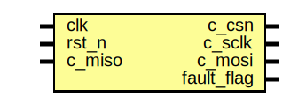

# Entity: top 
- **File**: top.v

## Diagram

## Ports

| Port name  | Direction | Type | Description |
| ---------- | --------- | ---- | ----------- |
| clk        | input     |      |             |
| rst_n      | input     |      |             |
| c_miso     | input     |      |             |
| c_csn      | output    |      |             |
| c_sclk     | output    |      |             |
| c_mosi     | output    |      |             |
| fault_flag | output    |      |             |

## Signals

| Name                | Type        | Description |
| ------------------- | ----------- | ----------- |
| prdata              | wire [31:0] |             |
| penable             | wire        |             |
| pwrite              | wire        |             |
| p_addr              | wire [31:0] |             |
| pwdata              | wire [31:0] |             |
| psel                | wire        |             |
| pready              | wire        |             |
| wire_data_out       | wire [15:0] |             |
| wire_data_out_valid | wire        |             |
| wire_cfg_c          | wire [15:0] |             |
| wire_cfg_n          | wire [15:0] |             |
| wire_cfg_start      | wire        |             |
| wire_cfg_threshold  | wire [31:0] |             |
| wire_mag_out        | wire [31:0] |             |
| wire_mag_out_valid  | wire        |             |

## Instantiations

- spi_master_inst: spi_master
- spi_apb_interface_inst: spi_apb_interface
- tmr_reg_bank_inst: tmr_reg_bank
- goertzel_core_inst: goertzel_core
- fault_flagger_inst: fault_flagger
